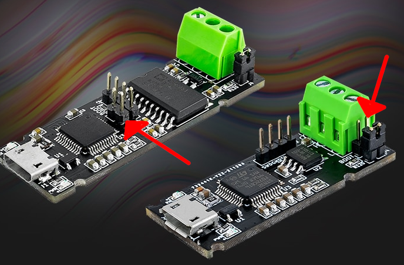

# Flashing Candlelight_FW
## Web updated - requires Chrome or Edge

The instructions here will get you sorted and you can refer to the below image for the boot pins on the MKS variant of the clones

Just follow the instructions here > **https://canable.io/updater/**
If you encounter issues follow the links they have for fixing Windows Drivers, or if on Linux adding a udev rule.

*Jumper the Boot pins*
MKS Canable, MKS Canable Pro

**Note: The same page can flash slcan firmware on the device also!**