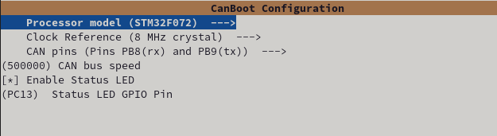
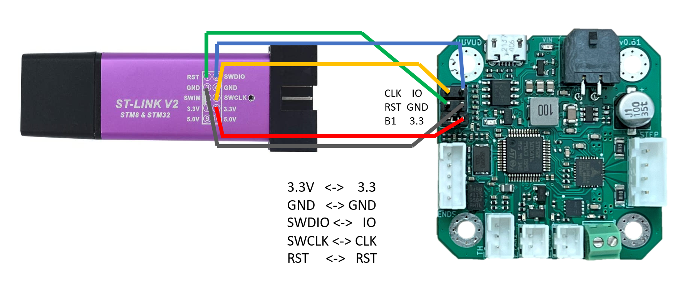
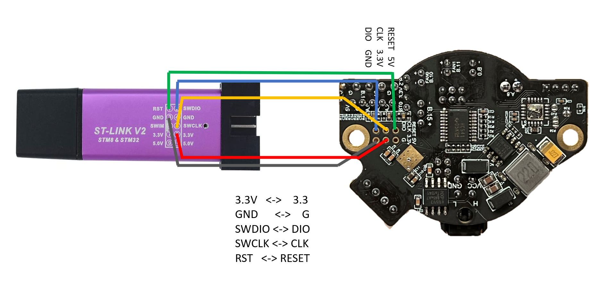

# CANboot

Canboot is a bootloader which can be used to flash firmware on your Toolhead board without resorting to jumpers and USB cables.

This can greatly simplify maintenance, and is seen by many as a great quality of life improvement.

Work is currently underway to introduce this functionality to Klipper via [this pr.](https://github.com/Klipper3d/klipper/pull/5420) 


### Flashing the canboot firmware via DFU on ST32F072C8 (SHT36/42)

**This method doesnt work for the Huvud as the STM32F103XX lacks a DFU bootloader so use [this](#flashing-via-stlink-v2)**


These  steps assume you have setup your Controller prior

1. Add jumper to Boot0 and 3.3v and connect the SHT via USB
2. Verify the device is in bootloader moad by using `lsusb`
   - you should see something like `Bus 001 Device 005: ID 0483:df11 STMicroelectronics STM Device in DFU Mode`
3. clone the CanBoot repository to your pi
   
    ```bash
    cd ~/
    git clone https://github.com/Arksine/CanBoot
    ```

4. run the following
    ```bash
    cd CanBoot
    make menuconfig
    ```

5. **\<Board specific check\>**
   
    

    exit using esc, confirm with yes(y)

6. build the firmware
    
    >`make`
    

7. flash the canboot bootloader to the board **YOUR DeviceID (0483:df11) may be difference CHECK IT!** *(see step 2)*

8. ERASE AND FLASH THE CANBOOT FIRMWARE
   
   >`sudo dfu-util -a 0 -D ~/CanBoot/out/canboot.bin --dfuse-address 0x08000000:force:mass-erase:leave -d 0483:df11`


9.  Power off the SHT, remove the boot jumper, and insert the CANBUS cable
10. You can now power up your printer with the toolhead board attached via the appropriate wiring scheme using the H L 24v and gnd wires.
    

11. Wait for the device to boot and ensure your CAN0 network is up and you can see the device 
    
    >`~/klippy-env/bin/python ~/klipper/scripts/canbus_query.py can0`

You should see something like `"Found canbus_uuid=XXXXXXXXXX, Application: CanBoot"`

\<pending image\>


12. Assumiing the above is working you can now flash Klipper to your board via CanBoot...

```bash 
cd ~/klipper
make menuconfig
```


Hit <kbd>Q</kbd> to exit and select <kbd>Y</kbd> to save changes.

```bash
make clean
make
```

You can now flash the board


```
python3 ~/CanBoot/scripts/flash_can.py -i can0 -f ~/klipper/out/klipper.bin -u MYUUID
```


If all is well you now have a klipper firmware on your SHT.

To verify this you can query the canbus uuid with 

    >`~/klippy-env/bin/python ~/klipper/scripts/canbus_query.py can0`

You should see something like `"Found canbus_uuid=XXXXXXXXXX, Application: Klipper"`


### Flashing via STLink v2


[eddietheengineer](https://github.com/eddietheengineer) has an excellent guide on flashing the CANBoot firmware.

[](https://www.youtube.com/watch?v=R75luW8K0kg "Flashing Klipper Firmware over")


Reference images can also be found in the [below the video.](#stlink-pinout-reference) 


## STLINK PINOUT REFERENCE

### HUVUD
[]()

### SHTxx
[]()


### [Return to Main](../index.md)
