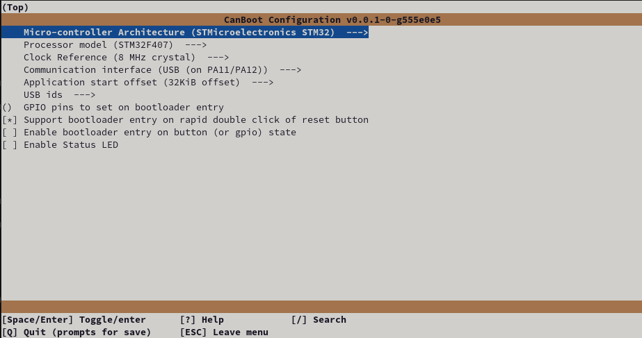
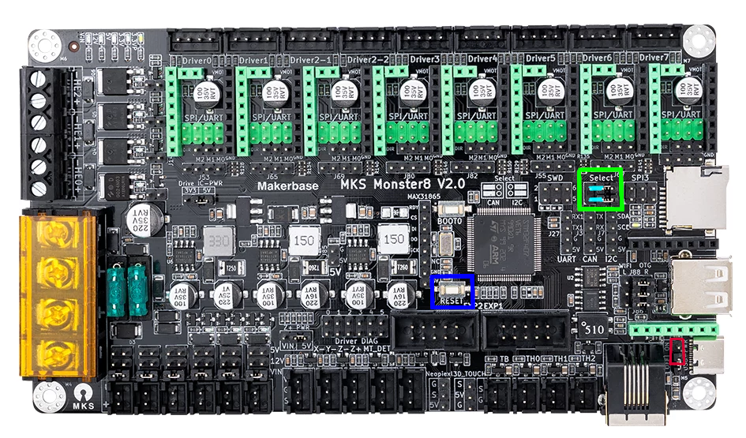
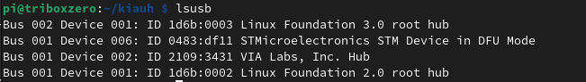
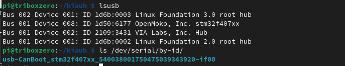
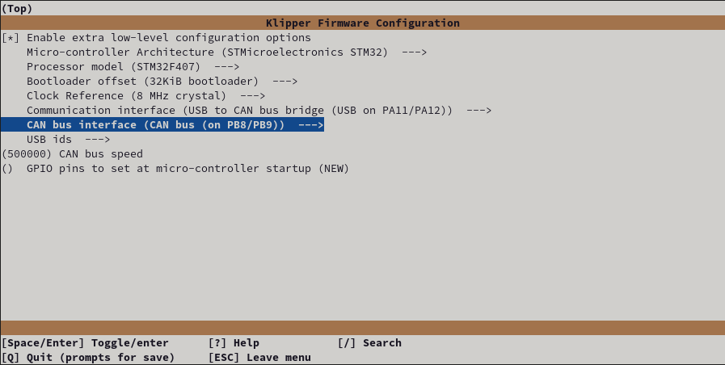
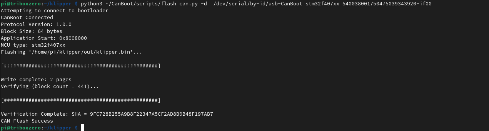
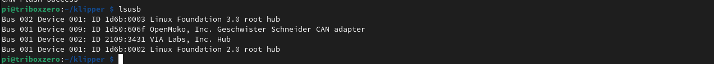
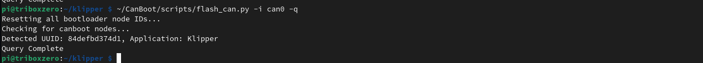
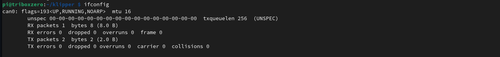
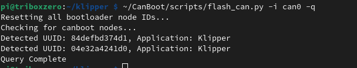

# MKS Monster8 v2 as a Can to USB bridge adapter

This is end to end so it'll include all steps taken after creating a new **RaspberryPI OS Lite (32-bit)**  image and logging into SSH for the first time.


## **PI Setup** 

### Download and install GIT

```bash
sudo apt install git
```


### Download Kiuah and install Klipper,Moonraker,Mainsail/Fluidd

```ini
cd ~
git clone https://github.com/th33xitus/kiauh.git
./kiauh/kiauh.sh
```

Note if running these back to back, kiuah will keep you in the install menu until you exit yourself so you dont need to navigate to/from the main menu each time.

**Klipper**
> From the main menu
>
>   <kbd>1</kbd> - [Install] 
> 
>   <kbd>1</kbd> - [Klipper]
> 
>   <kbd>2</kbd> - [Python 3.x] (experimental)
>
>   Number of Klipper instances to set up: <kbd>1</kbd> and confirm using the <kbd>Y</kbd> option


**Moonraker**
> From the main menu
> 
> <kbd>1</kbd> - [Install]
> 
> <kbd>2</kbd> - [Moonraker]
>
> Confirm using <kbd>Y</kbd>
> 
> If prompted press <kbd>Y</kbd> to add your user to the TTY group
 
**Mainsail/ Fluidd**
> From the main menu
> 
> <kbd>1</kbd> - [Install]
> 
> (<kbd>3</kbd> or <kbd>4</kbd>) <kbd>3</kbd> for [Mainsail] or <kbd>4</kbd> for [Fluidd]
>
> Follow the prompts

**Exit Kiuah**
<kbd>B</kbd> <kbd>enter</kbd>  then <kbd>Q</kbd> <kbd>enter</kbd>
or just hit <kbd>CTRL</kbd> + <kbd>C</kbd>


### Download CanBoot and install pyserial

```ini
cd ~
git clone https://github.com/Arksine/CanBoot
```

Install pyserial
```ini
pip3 install pyserial
```


### Make CanBoot Firmware

```ini
cd CanBoot
make menuconfig
```




**Exit using <kbd>Q</kbd> or <kbd>ESC</kbd> and confirming changes with <kbd>Y</kbd>**


Build the firmware (clean)

```ini
make clean
make
```


### Set jumpers and connect the MKS Monster8 to the PI via USB

Insert the USB power jumper per the red box below

**Ensure the SELECT jumpers are in the CAN position (green box, blue lines)**

Connect the board to the PI via USB C

Double press the Reset button marked with a green box below (alternativley hold the boot button while connecting the board via USB)




Verify the device is in DFU mode using 
```bash
lsusb
```

You should see a `STMicroelectronics STM Device in DFU mode` listed




### Flash CanBoot

We can now flash the canboot bootloader we created

```bash 
sudo dfu-util -a 0 -D ~/CanBoot/out/canboot.bin --dfuse-address 0x08000000:force:mass-erase:leave -d 0483:df11
```

**NOTE: If you see an error after the above, don't worry its fine, provided you have the "File Downloaded Sucessfully" on the line before the error**

 

### Verify the CanBoot usb bootloader is loaded (requires double tap of RESET button)

`lsusb` should show an OpenMoko device stm32f407xx

`ls /dev/serial/by-id/` should show a device serial.

both are shown in the below image for reference.




**NOTE:** the `/dev/serial/by-id/usb-CanBoot_stm32f407xx_<NUMBERSHERE>-if00` is needed for the next steps :)


### Make Klipper Firmware

```bash
cd ~/klipper
make menuconfig
```




**Exit using <kbd>Q</kbd> or <kbd>ESC</kbd> and confirming changes with <kbd>Y</kbd>**

```bash
make clean
make
```


### Flash the new firmware via CanBoot

Ensuring that the board is in [canboot mode](#verify-the-canboot-usb-bootloader-is-loaded-requires-double-tap-of-reset-button)

you can now use the ```/dev/serial/by-id/usb-CanBoot_stm32f407xx_``` line in the following command to flash your board with the klipper firmware.

```ini
python3 ~/CanBoot/scripts/flash_can.py -d  /dev/serial/by-id/usb-CanBoot_stm32f407xx_<NUMBERSHERE>-if00
```



# Setting up the CAN0 network

This differs slightly as we want to allow hotplug (should help with normal MCU restarts)

`sudo nano /etc/network/interfaces.d/can0`

```bash
allow-hotplug can0
iface can0 can static
 bitrate 500000
 up ifconfig $IFACE txqueuelen 256
 pre-up ip link set can0 type can bitrate 500000
 pre-up ip link set can0 txqueuelen 256
 ```

and press <kbd>Ctrl</kbd>+<kbd>X</kbd> to save.

you can now reboot the pi with ` sudo reboot `


## Verify the adapter is seen

`lsusb`




## **You can now connect 24V to the board**

## Verify the "virtual" device is visible

```
~/CanBoot/scripts/flash_can.py -i can0 -q
```


*(this may say CanBoot dont worry, just note the UUID for the config!)*

## Check the CAN0 network is up




## Wiring a child device

I'm using the RJ12 port with an RJ11 adapter found on ebay for £2-3 with the below setup
[mcu]
serial: /dev/serial/by-id/usb-Klipper_stm32f446xx_2A0031000B50534E4E313120-if00
restart_method: commandmonster8v2_canwires.png)


Note: it may be possible to use two alternate conifgurations per the pinouts here (https://github.com/makerbase-mks/MKS-Monster8/blob/main/hardware/MKS%20Monster8%20V2.0_003/MKS%20Monster8%20V2.0_003%20PIN.pdf)

1. EXT_1 with PA8/PA9
2. CAN header TX and RX pins

- Unfortunatley in my own testing I could not get these alternate pins to connect to my EBB36v1.1 board (YMMV)


# Success


```
~/CanBoot/scripts/flash_can.py -i can0 -q
```




Note: the only configuration changes between CAN and USB for the Monster is to change the [mcu] section from 


```
[mcu]
serial: /dev/serial/by-id/usb-Klipper_stm32f446xx_2A0031000B50534E4E313120-if00
restart_method: command
```

to 
```ini
[mcu]
canbus_uuid: <UUID>
restart_method: command
```


other can devices can be added as secondary MCU's using the example configs found [here](canboot.md).


### [Return to Main](../index.md)
