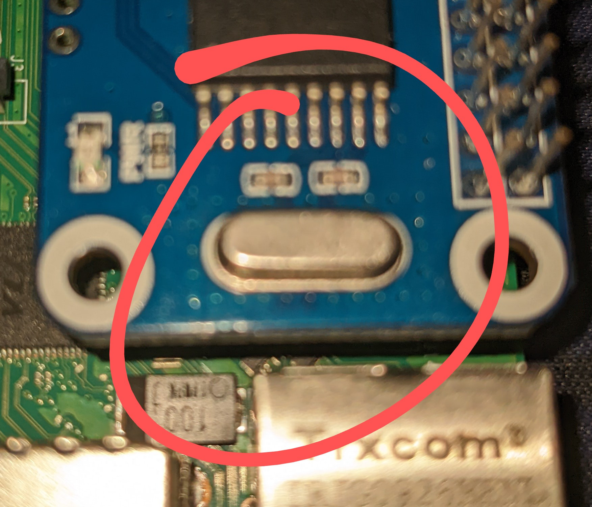

# RS485

All instructions assume a default raspbian install, mainsailos/fluidos may have some of these steps completed for you.
## ** Physical Setup **

These steps will get a Waveshare RS485 or similar CAN hat interface up and running.

Please note that this board may have compatability issues if you run your regular printer MCU via UART instead of USB as the pins overlap.

### ** Mount the Waveshare board to the PI **

1. Mount the 40 PIN header from the Waveshare RS485 hat to your PI so that the bulk of the Waveshare board is over the PI (within the pi's footprint).

### **Identify the reference clock**

Find the clock chip on the CAN HAT and read the number from the top, you will need to know this for the next step(s).

[]()

## ** Raspberry PI Configuration **

SSH Into the PI

### **Enable SPI & Serial interfaces**

> `sudo raspi-config`

1. Select Interfaces
   1. Select SPI
   1. Select Yes
1. Select Interfaces
   1. Select Serial
   1. Select Yes to both Options
Exit and reboot

### **Check serial and add your overlays **
#### Check the serial config

> `nano /boot/cmdline.txt`

Should look a little something like the below example.

```ini
console=tty1 console=serial0,115200 root=PARTUUID=8f81106e-02 rootfstype=ext4 fsck.repair=yes rootwait
```

press <kbd>Ctrl</kbd>+<kbd>X</kbd> to exit.


If yours is missing the *`console=tty1 console=serial0`* at the start then you missed something above and will need to follow the steps outlined in [Enable SPI  & Serial Interfaces](#enable-spi--serial-interfaces)

#### Add any missing overlays

Via SSH enter

> `sudo nano /boot/config.txt`

You should see a block titled `[all]` towards the bottom of the file.
under the heading it should read a little like the below.

```ini
[all]
dtoverlay=pi3-miniuart-bt
enable_uart=1
```

If your clock read 8mhz in the previous step add the following to the `[all]` section:

```ini
dtoverlay=mcp2515-can0,oscillator=8000000,interrupt=25,spimaxfrequency=1000000
dtoverlay=spi1-1cs
```
press <kbd>Ctrl</kbd>+<kbd>X</kbd> and follow the prompts to save without changing the name.


If it read 12mhz, enter the following instead
```ini
dtoverlay=mcp2515-can0,oscillator=12000000,interrupt=25,spimaxfrequency=2000000
dtoverlay=spi1-1cs
```

press <kbd>Ctrl</kbd>+<kbd>X</kbd> and follow the prompts to save without changing the name.


**The final config.txt file should look a little like this**

```ini
[all]
dtoverlay=pi3-miniuart-bt
enable_uart=1
dtoverlay=mcp2515-can0,oscillator=12000000,interrupt=25,spimaxfrequency=2000000
dtoverlay=spi1-1cs
```

### **Create your CAN network**

AS the CAN network does not already exist we need to create it.

To do this type 

> `sudo nano /etc/network/interfaces.d/can0`

Add the following to the file

```bash
auto can0
iface can0 can static
    bitrate 250000
    up ifconfig $IFACE txqueuelen 256
    pre-up ip link set can0 type can bitrate 250000 
    pre-up ip link set can0 txqueuelen 256
```

press <kbd>Ctrl</kbd>+<kbd>X</kbd> and follow the prompts to save without changing the name.


These are your "safe defaults" depending on other factors you may be able to adjust your bitrate and txqueuelen up or down from here.

> **WARNING: IT IS CRITICAL THAT YOUR CAN NETWORK & TOOLHEAD UTILISE THE SAME BITRATE!**


Now you can enter `sudo reboot` to reboot the PI and verify that the CAN0 network is up with the following command.

> `ifconfig can0`

If you see something similar to the below then all is good and you can move on to flashing /wiring your toolboard.
```ini
$ can0: flags=193<UP,RUNNING,NOARP> 
$     unspec 00-00-00-00-00-00-00-00-00-00-00-00-00-00-00-00  txqueuelen 256 (UNSPEC)
$     RX packets 4  bytes 32 (32.0 B)
$     RX errors 0  dropped 0  overruns 0  frame 0
$     TX packets 4  bytes 32 (32.0 B)
$     TX errors 1  dropped 1 overruns 0  carrier 1  collisions 0
```

### CAN Network troubleshooting
A message like 
> `can0: error fetching interface information: Device not found`
> 
indicates that your interface is incorrectly configured, so you should check your `/etc/network/interfaces.d/can0` file.


### resources

https://www.klipper3d.org/CANBUS.html
https://www.waveshare.com/wiki/RS485_CAN_HAT

### [Return to Main](../readme.md)
