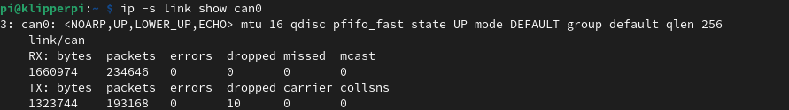
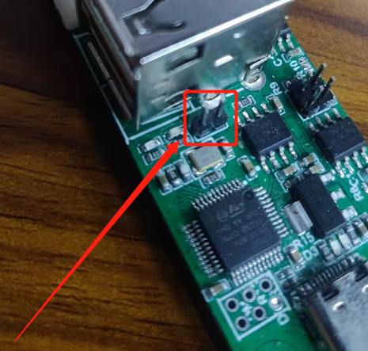

# 3DMellow UTOC 1 & 3

## **PI Setup**

` sudo nano /etc/network/interfaces.d/can0 `

```bash
auto can0
iface can0 can static
 bitrate 500000
 up ifconfig $IFACE txqueuelen 256
 pre-up ip link set can0 type can bitrate 500000
 pre-up ip link set can0 txqueuelen 256
 ```

and press <kbd>Ctrl</kbd>+<kbd>X</kbd> to save.

you can now reboot the pi with ` sudo reboot `


## Test the network

Once the pi has rebooted you can run the `ip -s link show can0` command to check your network status.

You should see a line like the below in the results.
The key thing to note is that the network is **UP** for now.



## Wiring Guide -- Coming Soon

## Termination Guide - Coming Soon

## Troubleshooting

1. > My device doesnt have a name when I run `lsusb`
   
If your device id is `4d4c:5543` you have an early revision of the board intended for use with the Gemini boards, these boards ship with a firmware which is not recognised by Linux and will require manual flashing in order to resolve. [see utoc flashing](#flashing-utoc-firmware)


2. > I can see my `can0` network but when I connect my device to query the uuid there is no value returned.

    [Check Wiring]()

    [Check Firmware]()

    [Check Termination]()


## Flashing UTOC Firmware

[back to top](#3dmellow-utoc-1--3)


In order to flash the UTOC a jumper cap needs to be installed as indicated in the picture (for UTOC-1 I believe it's in the same place).




**NOTE: you can also just flash [candlelight_fw](./candlelight_fw.md)**


If you want the firmware provided by Mellow to flash its here > [utc_firmware.bin](./firmware_files/utoc_firmware.bin) 


### [Return to Main](../index.md)