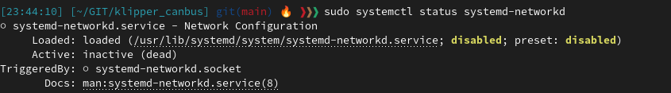

# systemd-networkd 

Is a newer networking system daemon used by Debian and Ubuntu amongst others
At this time its not known if/when the raspbian stack will move to this standard.


## Am I using systemd-networkd


You can check by running the following.

`sudo systemctl status systemd-networkd`

If you see the following then you can leave this page :)

  [](../images/systemctrlsystemd-networkd.png) [


otherwise continue

### Check your version of systemd supports CAN interfaces

Run 
```ini 
systemctl --version
```

If it reports a systemd version number of 239 or higher you are fine to continue.


### creating a CAN network for systemd-networkd

Run 
```ini 
sudo ls /etc/systemd/network/
```

If you see `80-can.network` check its blank before you blindly overwrite anything (its probably blank)

Running the below will open the existing file for editing, OR if none exist it will create a new file.
```ini
sudo nano /etc/systemd/network/80-can.network
```

Populate the file

```ini
[Match]
Name=can0

[Network]
BitRate=1000000
```

and press <kbd>Ctrl</kbd>+<kbd>X</kbd> to save. (You can overwrite)

### Create a CAN link for systemd-networkd

Next up we can create a .link file which will allow setting of the txqueuelen and network type.

Again we can run the below to create an empty file.
```ini
sudo nano /etc/systemd/network/80-can.link
``` 

Populate the file

```ini
[Match]
Type=can

[Link]
TransmitQueueLength=256
```

and press <kbd>Ctrl</kbd>+<kbd>X</kbd> to save. (You can overwrite)


### Restarting the network stack

The following commands will restart the stack incoporating your new network settings

```ini
sudo systemctl restart systemd-networkd
```

You can check the status after with

```ini
sudo systemctl status systemd-networkd
```


#### Bringing the network online.

Note: this step may be suplurfious depending on your order of operations.

Ensure your USB CAN adapter is connected and visible via **`lsusb`**

It will present with an id of **`1d50:606f`** for most Candlelight_Fw devices, but may present differently if you have SLCAN firmware.


check if the network is up

```ini
ip -details link show can0
```

If you see a warning about the device not existing you need to check that your OS is seeing the device.


If you dont see a network but your USB device is connected and visible, run the following to force the nework up.

```ini
sudo ip link set up can0
```


Double check the network came up

```ini
ip -details link show can0
```

A good network will look like this (for now)

```ini
can0: <NOARP,UP,LOWER_UP,ECHO> mtu 16 qdisc pfifo_fast state UP mode DEFAULT group default qlen 10
    link/can  promiscuity 0 minmtu 0 maxmtu 0 
    can state ERROR-ACTIVE restart-ms 0 
          bitrate 500000 sample-point 0.875 
          tq 125 prop-seg 6 phase-seg1 7 phase-seg2 2 sjw 1
          gs_usb: tseg1 1..16 tseg2 1..8 sjw 1..4 brp 1..1024 brp-inc 1
          clock 48000000 numtxqueues 1 numrxqueues 1 gso_max_size 65536 gso_max_segs 65535 parentbus usb parentdev 1-2:1.0
```

references: 
 - https://medium.com/100-days-of-linux/working-with-systemd-networkd-e461cfe80e6d  
 - https://manpages.ubuntu.com/manpages/bionic/man5/systemd.network.5.html


Continue along with the rest of this guide to setup your toolhead and the rest :)

### [Return to Main](../index.md)