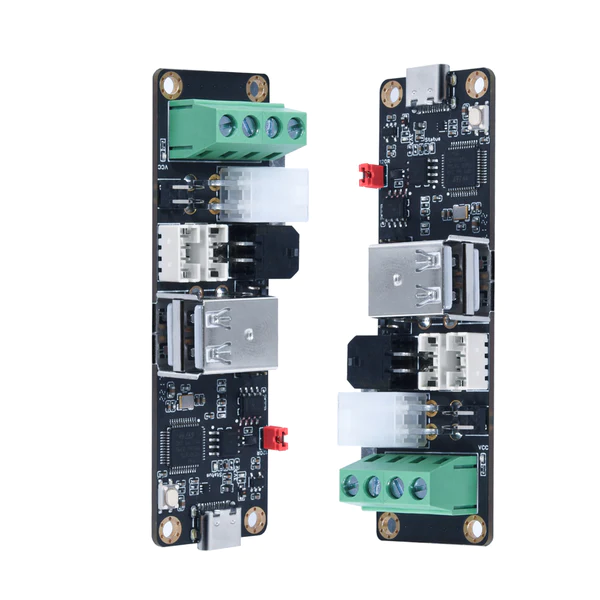
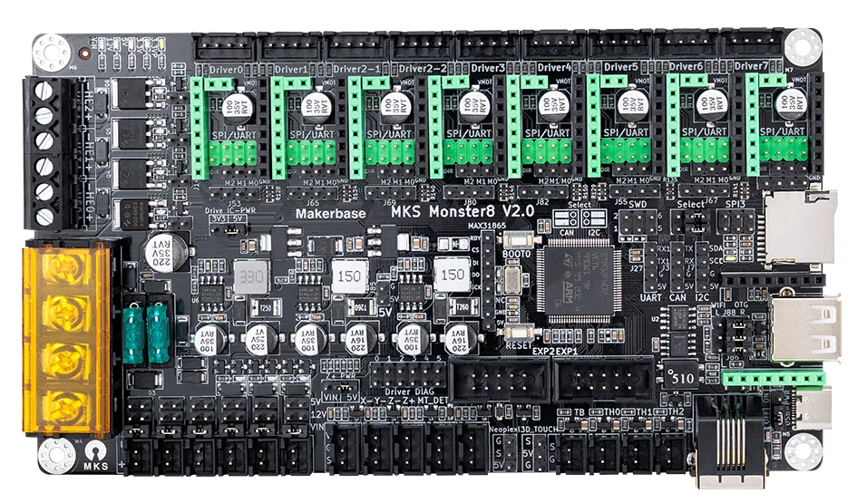
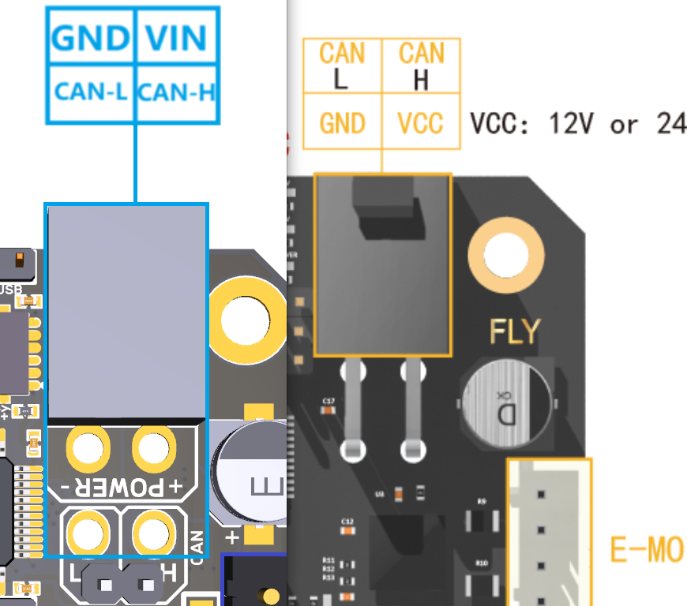
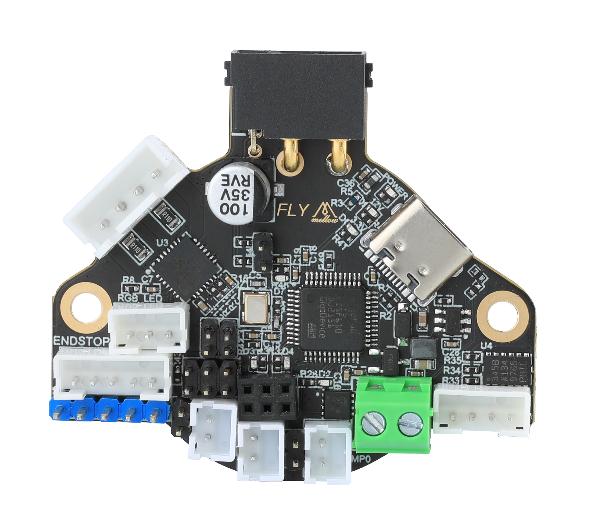
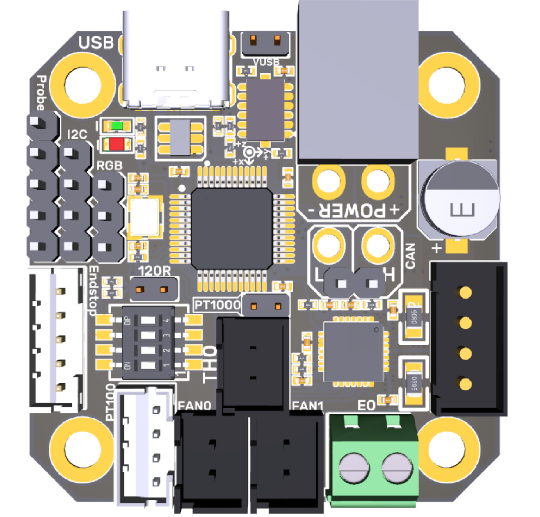
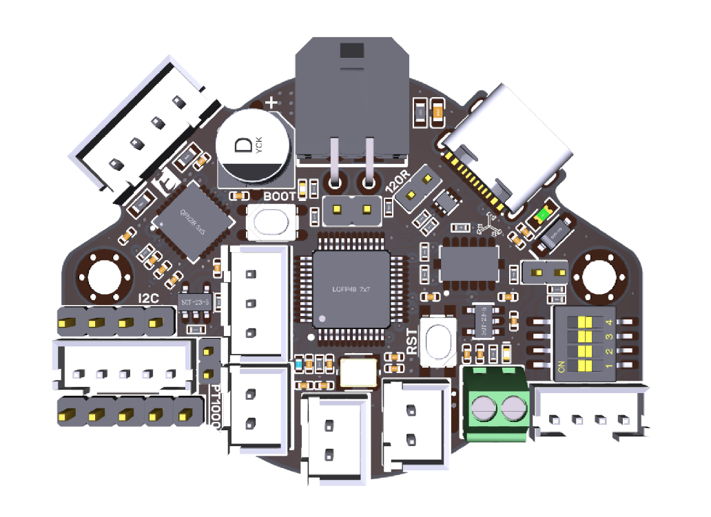
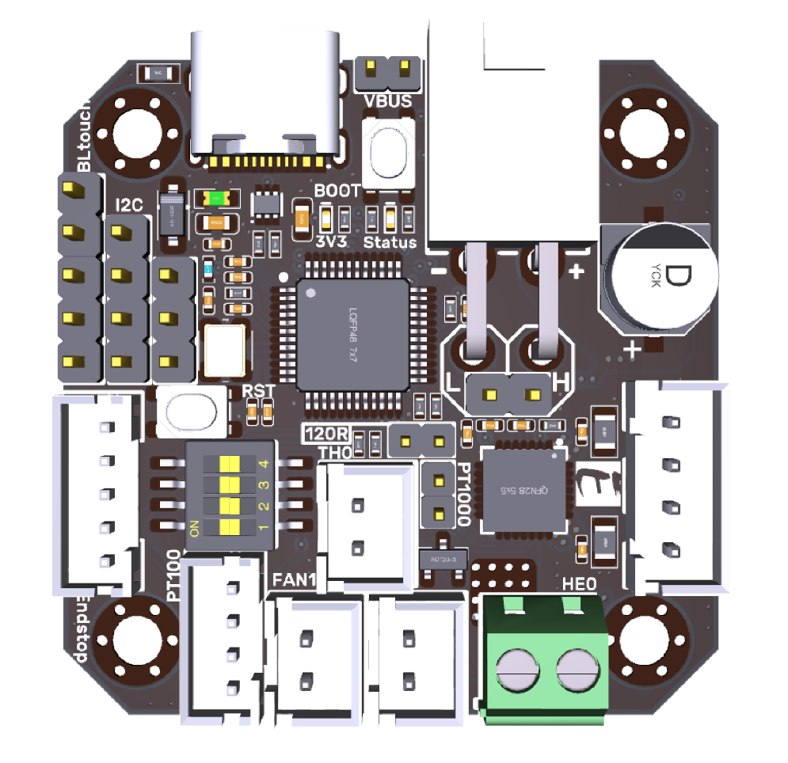
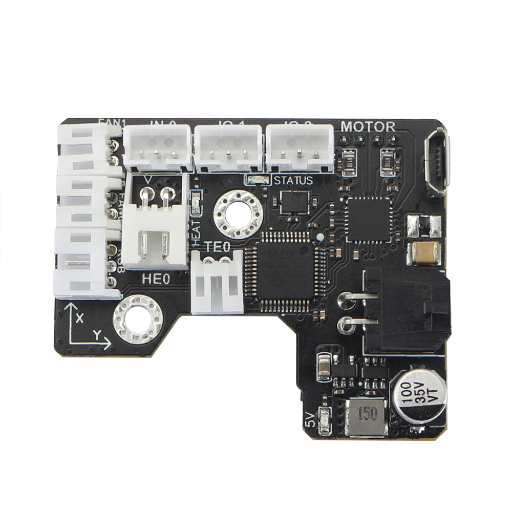
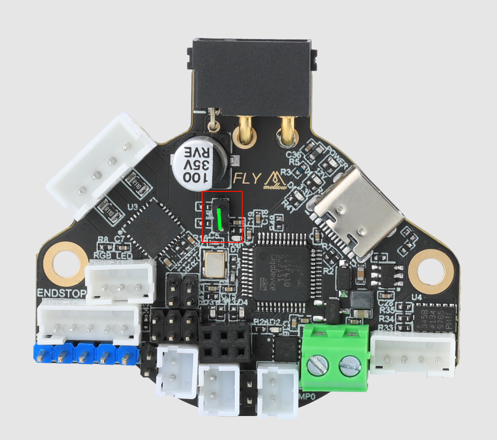

# CANBUS TOOLHEAD INSTALL

Assumptions

- A working instance of Klipper, Moonraker and / or Mainsail/Fluidd
- Access to the Raspberry PI terminal (via SSH or physical keyboard/mouse/display)
- A CAN adapter (USB or SPI)
  - Waveshare RS485 (Serial)
  - MKB Canable / Canable Pro (USB)
  - UTOC-1/3
  - Other... (some things may vary)
- A CAN toolhead board
  - Huvud
  - EBB36/42
  - SHT36/42
  - TurboCAN
  - SB CAN
- This guide and a brew (or coffee if you must)
  

## **IMPORTANT**

Each controller page has a set of "safe" default settings which should work for the majority of users, you should initially setup your controller based on these values as these will inform some of the settings to be used for your Toolhead board of choice *i.e. the bitrate*

## Overview
### What is Canbus

CANbus is vehicle standard that allows for communication between multiple devices on a single network (multiplex wiring). The protocol has been used in Automotive applications since the early 90's and it's ubiquitous in modern vehicles.

Want to know more: [https://en.wikipedia.org/wiki/CAN_bus](https://en.wikipedia.org/wiki/CAN_bus)

### Why do I want it

Wires be heavy yo.

### *A simplified overview of Canbus wiring*

## [More wiring layouts](/wiring.md)

- [ ] Explain termination
- [ ] Highlight where different controller/board combinations may be wired differently (termination/ground/voltage passthrough etc).

***
## Special Notes

#### Running Ubuntu Server or another Linux distribution that utilises systemd-networkd?

[Use this for your network steps](./extras/systemd-networkd.md)

## Control boards

[canable](./controller/canable.md) 

[can2usb](./controller/can2usb.md)

[rs485 (waveshare)](./controller/rs485.md)

[utoc](./controller/utoc1-3.md)

[u2c](./controller/u2c.md)

## Klipper USBtoCAN bridge Adapters

## [MKS Monster8 v2](./controller/monster8v2.md)

## [Manta M5P](./controller/mantam5p.md)

## Use your Printers Controlboard as USB2CAN adapter!

Following a recent merge by the Klipper dev's it is now possible to flash a version of firmware to boards such as the Octopus, Spider and Makerbase Monster8, to enable using them as both a CANBus Adapter while retaining the ability to print normally!.

**[https://www.klipper3d.org/CANBUS.html#usb-to-can-bus-bridge-mode](https://www.klipper3d.org/CANBUS.html#usb-to-can-bus-bridge-mode)**

I'll add a full walkthrough with pictures soon.

## Special Bootloaders (Optional but recommended)

[canboot](./controller/canboot.md)

## Toolhead boards

**EXAMPLE CONFIGURATIONS HERE**
## [example configs](./toolhead/examples.md)
**^^^ EXAMPLE CONFIGURATIONS HERE ^^^**

## Toolhead boards

### **PSA**
**Not all toolheads boards use the same wiring so PLEASE CHECK YOUR WIRING**

*example of the EBB42 alongside the SHT36, note the pins are *

### [Huvud](./toolhead/huvud-0.61.md)

### [SHTXX (v1)](./toolhead/sht36-42.md)

### [SHT36 (v2)](./toolhead/sht36v2.md)

### [EBB v1.0 (F072)](./toolhead/ebb36-42_v1.0.md)

### [EBB v1.1 (G0B1)](./toolhead/ebb36-42_v1.1.md)

### [EBB v1.2 (G0B1)](./toolhead/ebb36-42_v1.2.md)

[TurboCAN](./toolhead/turbocan.md)

[SB CAN TH v1.1](./toolhead/sb_can_v1.1.md)

## Connecting your controller to your Toolhead board

.. stub with just text for now but will add diagrams for various configurations.

.. termination resistors

### RS485 / Waveshare HAT

The Waveshare CAN HAT has an integrated termination and it's best practice to add pullup at the toolhead.

- H on the Waveshare to H on the toolhead
- L on the Waveshare to L on the toolhead
- 12/24v from PSU 12/24v on Toolhead 
- GND from PSU oo toolhead

### UTOC-1 / UTOC-3

- USB from the PI to the UTOC board
- H on UTOC to H on toolhead
- L on UTOC to L on toolhead
- 24V from  PSU to UTOC
- GND from PSU to UTOC
- 24 on UTOC to 24 on toolhead
- GND on UTOC to GND on toolhead

### CANABLE / CANABLE PRO

#### Normal

`<no image>`

- USB from the PI
- GND from PSU to GND on the CANABLE
- GND from PSU to GND on toolhead 
- 12/24v from PSU to 12/24v on toolhead 
- H from Canable to H on toolhead 
- L from Canable to L on toolhead

#### Termination resistors

Standard controller termination
`<no image>`

*There are two jumpers near the green port, bridge the furthest two along the edge of the boad*

Pro Controller termination

### Terminations

While noit compulsary it is useful to have terminations at both ends of a the can bus (note if chaining multiple devices only the START and END of the bus need termiations.)
#### HUVUD Termination

There is no 120ohm resistor on the board, you can solder your own SMT style resistor using the designated pads (shown below)

#### SHTXX Termination

The SHT boards include termination resistors and jumpers.
So simply bridge the green pins is per the images below.

##### 36

##### 42
 
 

##### 36 v2
 
