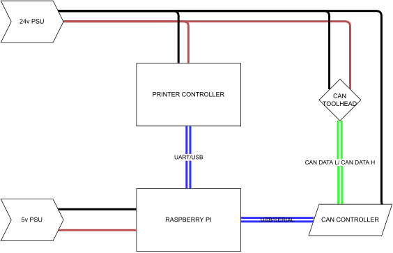

# CANBUS TOOLHEAD INSTALL

Assumptions

- A working instance of Klipper, Moonraker and / or Mainsail/Fluidd
- Access to the Raspberry PI terminal (via SSH or physical keyboard/mouse/display)
- A CAN adapter (USB or SPI)
  - Waveshare RS485 (Serial)
  - MKB Canable / Canable Pro (USB)
  - UTOC-1/3
  - Other... (some things may vary)
- A CAN toolhead board
  - Huvud
  - SHT36/42
  - TurboCAN

## Initial Setup

*An simplified overview of Canbus wiring*

## Control boards

[canable](./controller/canable.md) 

[can2usb](./controller/usb2can.md)

[rs485 (waveshare)](./controller/rs485.md)

[utoc](./controller/utoc1-3.md)

## Controller Setup

[RS485 PI Setup](./boards/rs485.md)

[Canable PI Setup](./boards/canable.md)

### Optional Flashing of Candlelight_fw

[Flashing Candlelight_fw](./boards/candlelight_fw.md)

### Flashing the MCU

[Huvud 0.61](./boards/huvud_firmware.md)

### Validation

PI W2 - BTT PICO - UART - MKS CANABLE PRO - HUVUD 0.61

PI 4B - BTT PICO - USB - Waveshare RS485 CAN HAT

