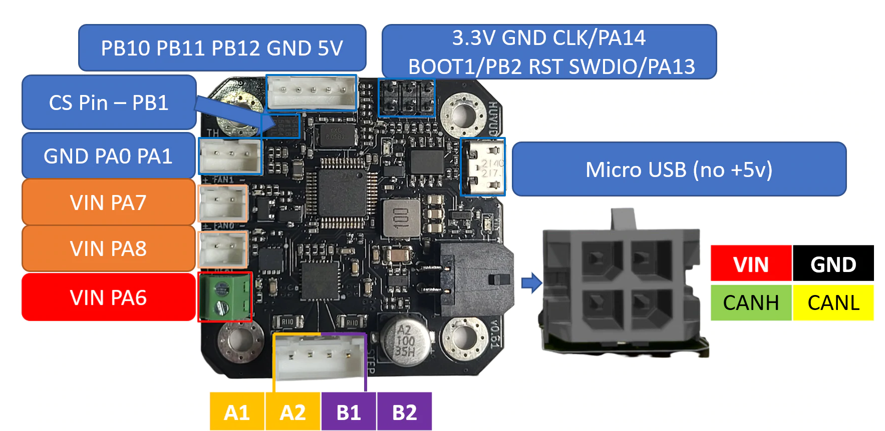
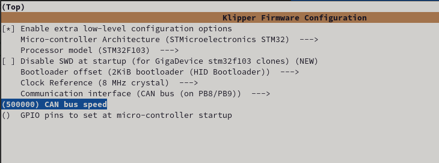

# Huvud Firmware

The boards should come preloaded with the HID bootloader for flashing over USB.

This firmware allows them to be flashed via USB however they will still require a 12/24v supply while flashing!

If this firmware is missing an STLINK is needed to perform a bootloader 

## Huvud Pinout

###

>!!!! Enable extra config options!!!!
>- Enable Micro-controller Architecture (STMicroelectronics STM32)
>- Select STM32F103 as the Processor Model
>- Select 2KiB bootloader (HID Bootloader) as the Bootloader offset
>- Clock Reference 8mhz (*[according to the spec sheet](https://github.com/bondus/KlipperToolboard/blob/master/PCB/HuvudTiny2/huvud061_schematics.pdf)*)
>- Set your CAN bus rate (250k or 500k are common)
>!!!! Pick CAN pins (Pins PB8(rx) and PB9(tx)) !!!!

Press <kbd>Q</kbd> to save and build the firmware.

### 
duo 
### Bootloader and Flashing

#### Wiring

Wire the boards up like so

#### Flashing

To enter the bootloader pin BOOT1 must be connected to  3.3V when the board is powered up or reset. When in the bootloader the  green LED will flash quickly. Flash with the command "make flash  FLASH_DEVICE=1209:beba"

Hopefully a CAN capable bootloader will be developed to allow flashing over CAN bus.

### [Return to Main](../index.md)