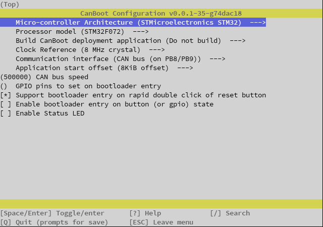
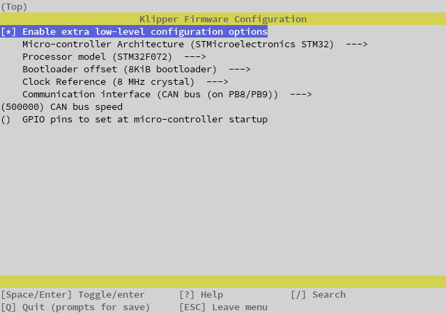

# FYSETC SB CAN TH (STM32F072)

## Important notes about this board

### **THE BOOT PIN IS PULLED HIGH DURING DFU MODE THIS PIN IS SHARED WITH THE HEATER AND WILL CAUSE YOUR HEATER TO HEAT - REMOVE 24V POWER WHEN ENTERING DFU MODE**

### **THE SILK SCREEN FOR V1.1 HAS PRINT ERRORS INDICATING WRONG VOLTAGES. CHECK THE [WIKI](https://wiki.fysetc.com/SB%20CAN%20ToolHead/#41-v11) FOR UPDATED INFORMATION**

## Flashing the canboot firmware via DFU on EBB36/42 (ST32G0B1)

**Before proceeding it is critical that your CAN network is configured for your printer, failure to setup the network will cause a problem when you try to connect devices :) click [here](../index.md#control-boards) and select your controller for setup instructions!**

### **Generate the CANboot firmware file**

1. clone the CanBoot repository to your pi

    >```bash
    >cd ~/
    >git clone https://github.com/Arksine/CanBoot
    >```

2. run the following

    >```bash
    >cd CanBoot
    >make menuconfig
    >```

3. Configure your makefile for the **FYSETC SB CAN TH with STM32F072**

    

    Exit using <kbd>ESC</kbd> or <kbd>Q</kbd>, confirm with yes(<kbd>Y</kbd>)

4. Build the firmware

    >```bash
    >make clean
    >
    >make
    >```

    

### **Hook up the board for flashing**

1. Power down SB-CAN-TH board for at least 5s by unplugging the CANBUS cable

2. Connect your device to your PI via USB

3. Reconnect the power supply / CAN signal input

4. Verify the device is in bootloader moad by using `lsusb`
   - you should see something like

   >```bash
   >    Bus 001 Device 005: ID 0483:df11 STMicroelectronics STM Device in DFU Mode
   >```

5. Flash the canboot bootloader to the board **YOUR DeviceID (0483:df11) may be different CHECK IT!** *(see step 2)*

6. ERASE AND FLASH THE CANBOOT FIRMWARE

   >```bash
   >sudo dfu-util -a 0 -D ~/CanBoot/out/canboot.bin --dfuse-address 0x08000000:force:mass-erase:leave -d 0483:df11
   >```

    

   **NOTE: If you see an error after the above, don't worry its fine, provided you have the "File Downloaded Sucessfully" and text above**

7. Power down SB-CAN-TH board for at least 5s by unplugging the CANBUS cable

8. Remove the USB cable

   -----

   **If you haven't setup your network yet, NOW is your last chance before it becomes a problem, click [here](../index.md#control-boards), and select your control board for instrutions, then return here and carry on :)**

   -----

9. You can now power up the toolhead board by reconnecting the CANBUS cable.

10. Wait for the device to boot and ensure your CAN0 network is up and you can see the device

    >```bash
    >~/klippy-env/bin/python ~/klipper/scripts/canbus_query.py can0
    >```

    or

    >```bash
    >~/CanBoot/scripts/flash_can.py -i can0 -q
    >```

    You should see something like

    >```bash
    >"Found canbus_uuid=XXXXXXXXXX, Application: CanBoot"
    >```

11. Assuming the above gave you a UUID you can now flash Klipper to your board via CanBoot... (if not see the troubleshooting section [here](../troubleshooting.md))

    >```bash
    >cd ~/klipper
    >make menuconfig
    >```

    >Enable low level configuratation
    >set the following.

    

    Hit <kbd>Q</kbd> to exit and select <kbd>Y</kbd> to save changes.

    >```bash
    >make clean
    >make
    >```

    **You can now flash the board**

    >```bash
    >python3 ~/CanBoot/scripts/flash_can.py -i can0 -f ~/klipper/out/klipper.bin -u MYUUID
    >```

    

    If all is well you now have a klipper firmware on your SHT.

    To verify this you can query the canbus uuid with

    >```bash
    >~/klippy-env/bin/python ~/klipper/scripts/canbus_query.py can0
    >```

    You should see something like

    >```bash
    >"Found canbus_uuid=XXXXXXXXXX, Application: Klipper"
    >```

## Need a config

1.1 [here you go](./example_configs/toolhead_fysect_sbcan_1_1.cfg)

Enjoy!

### [Return to Main](../index.md)

<WIP>
