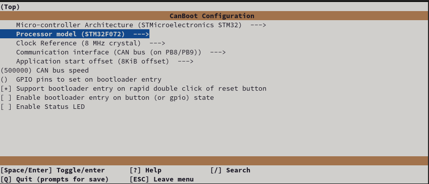
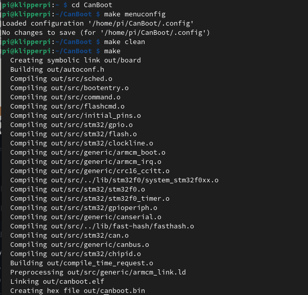
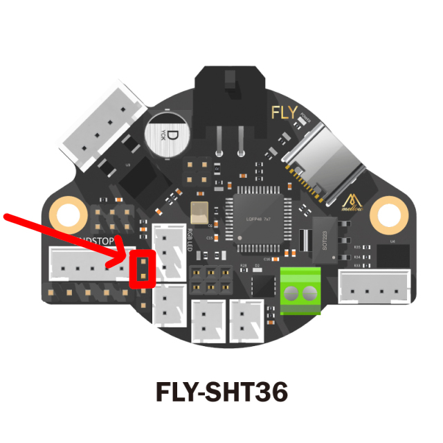
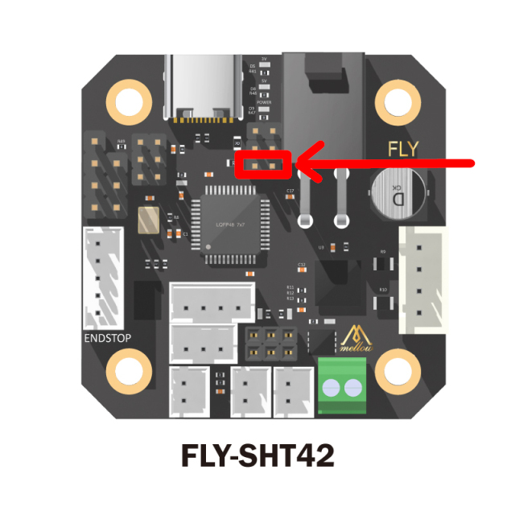
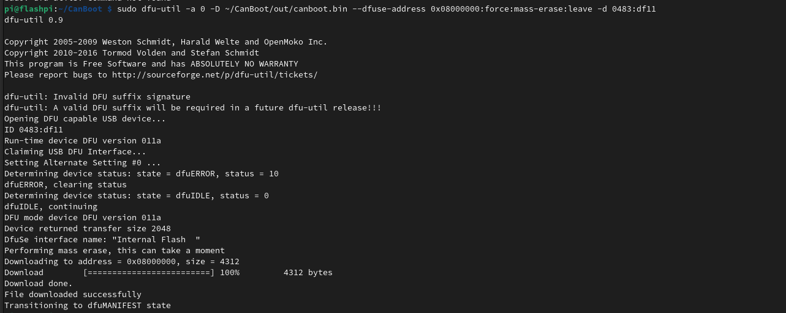
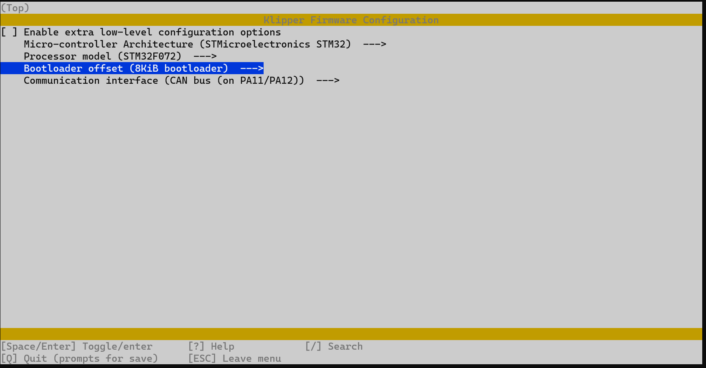
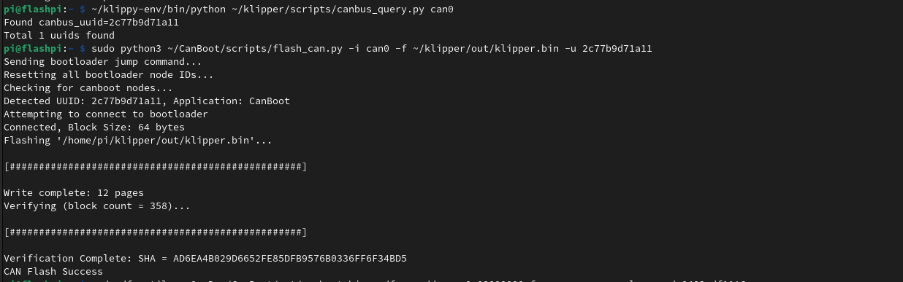

# MELLOW FLY SHT 36/42

**Important notes about this board.**

The pins **PC15, PB1** are not suitable for Klicky/Endstop and should be avoided. 

The probe port only supplies **5v** so may not work with certain **inductive** probes.

- **Pinda / BlTouch style probes will work fine**


# Flashing the canboot firmware via DFU on SHT36/42 (ST32F072C8)

These following steps assume you have setup your Controller and CAN0 network already and should be carried out on the Raspberry PI

## **Generate the CANboot firmware file**

1. clone the CanBoot repository to your pi
   
    >```bash
    >cd ~/
    >git clone https://github.com/Arksine/CanBoot
    >```

2. run the following

    >```bash
    >cd CanBoot
    >make menuconfig
    >```

5. Configure your makefile for the **SHT 36 / 42 with STM32F072**
   
    

    
    Exit using <kbd>ESC</kbd> or <kbd>Q</kbd>, confirm with yes(<kbd>Y</kbd>)

6. Build the firmware
    >```bash
    >make clean
    >
    >make
    >```

    


## **Hook up the Board for flashing**

1. Add the boot jumper to the pins highlighted below


    [](../images/sht36_boot.jpg) [](../images/sht42_boot.jpg)


2. Connect your device to your PI via USB 

2. Verify the device is in bootloader mode by using `lsusb`
   - you should see something like 
   >```bash 
   >    Bus 001 Device 005: ID 0483:df11 STMicroelectronics STM Device in DFU Mode
   >```


7. Flash the canboot bootloader to the board **YOUR DeviceID (0483:df11) may be different CHECK IT!** *(see step 2)*

8. ERASE AND FLASH THE CANBOOT FIRMWARE
   
   >```bash 
   >sudo dfu-util -a 0 -D ~/CanBoot/out/canboot.bin --dfuse-address 0x08000000:force:mass-erase:leave -d 0483:df11
   >```

    

9.  Power off the SHT, remove the boot jumper, and insert the CANBUS cable

10. You can now power up your printer with the toolhead board attached via the appropriate wiring scheme using the H L 24v and gnd wires.  

11. Wait for the device to boot and ensure your CAN0 network is up and you can see the device 
    
    >```bash
    >~/klippy-env/bin/python ~/klipper/scripts/canbus_query.py can0
    >```

    or

    >```bash
    >~/CanBoot/scripts/flash_can.py -i can0 -q
    >```

    You should see something like 

    >```bash
    >"Found canbus_uuid=XXXXXXXXXX, Application: CanBoot"
    >```


12. Assuming the above gave you a UUID you can now flash Klipper to your board via CanBoot... (if not see the troubleshooting section [here](../troubleshooting.md))

    >```bash 
    >cd ~/klipper
    >make menuconfig
    >```

    >Enable low level configuratation
    >set the following.

    

    Hit <kbd>Q</kbd> to exit and select <kbd>Y</kbd> to save changes.

    >```bash
    >make clean
    >make
    >```

    **You can now flash the board**

    ```
    python3 ~/CanBoot/scripts/flash_can.py -i can0 -f ~/klipper/out/klipper.bin -u MYUUID
    ```

    


    If all is well you now have a klipper firmware on your SHT.

    To verify this you can query the canbus uuid with 

    >```bash
    >~/klippy-env/bin/python ~/klipper/scripts/canbus_query.py can0
    >```

    You should see something like 

    >```bash
    >"Found canbus_uuid=XXXXXXXXXX, Application: Klipper"
    >```

    

## Need a config [here you go](./example_configs/toolhead_mellow3d_sht_xx.cfg)


Enjoy!


### [Return to Main](../index.md)
