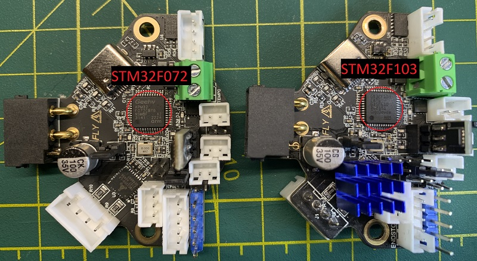
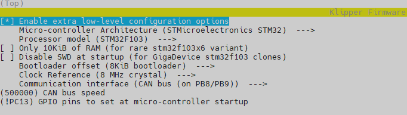
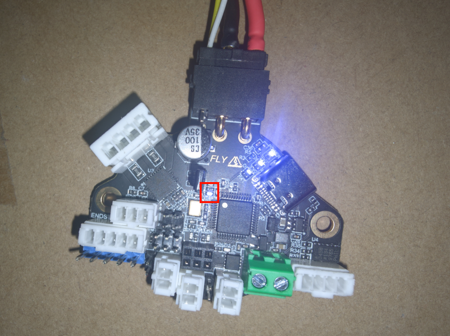
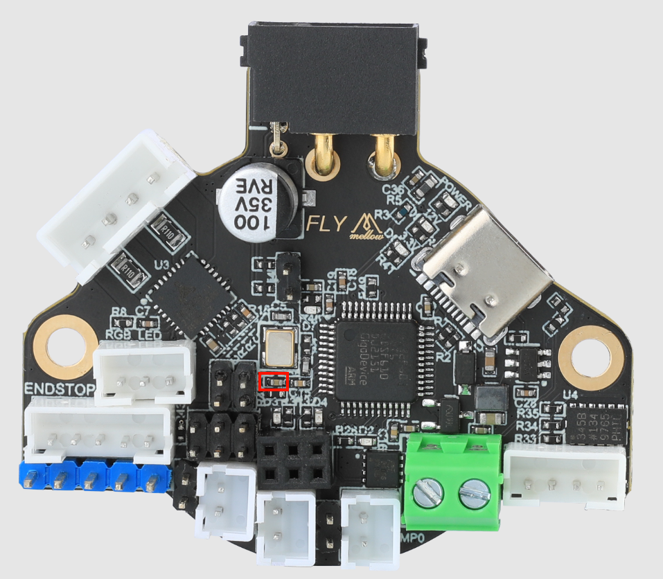
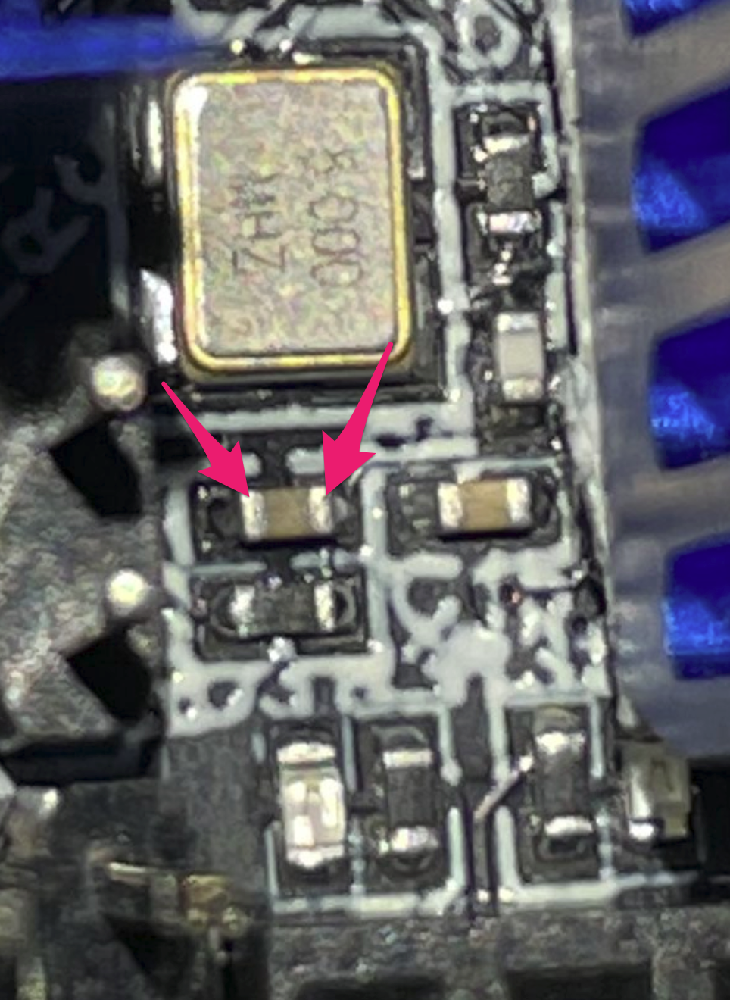

# MELLOW FLY SHT 36 v2

**Important notes about this board.**
- This board can **ONLY** be flashed through CAN, there is no DFU or debug header!
- There are two different MCUs used on this board. Make sure you select the correct one when building firmware.

# **Before proceeding, it is critical that your CAN network is configured for your printer, failure to setup the network will cause a problem when you try to connect devices :) click [here](../index.md#control-boards) and select your controller for setup instructions!**

## Flashing klipper firmware using CanBoot bootloader

### 1. Make sure your CAN network is terminated.   
   - The UTOC-1/3 boards already have one terminating resistor.  
   - **One** other device in the network should also have one. This is usually the toolboard itself. If you for example have multiple toolboards.   
     Only activate the resistor on **one**!

### 2. Determine which MCU your board uses

According to [Mellow](https://mellow.klipper.cn/?spm=a2g0o.detail.1000023.17.5cdd14f6OsvKtM#/board/fly_sht_v2/flash?id=%e7%bc%96%e8%af%91%e5%9b%ba%e4%bb%b6):

> Note, please pay attention to the main control chip purchased after 2022-10-18, the first batch is GD32F103, and the later shipment is APM32F072

You'll need to configure the Klipper firmware build differently depending on which chip your board has.
The easiest way to tell the two MCUs apart is to match the text printed on the chip to the iamge below.



Make a note of whether your MCU is `STM32F103` or `STM32F072`. You'll need this later.

### 3. Scan for can devices
```shell
python3 ~/klipper/lib/canboot/flash_can.py -q
```
You should see an output similar to this:
````shell
pi@mainsailos:~/klipper $ python3 ~/klipper/lib/canboot/flash_can.py -q
Resetting all bootloader node IDs...
Checking for canboot nodes...
Detected UUID: e5db694aab74, Application: Klipper
Query Complete
````
Note down the Detected UUID (In my case `e5db694aab74`).

If no device was found. Please check your wiring as well as your ``can0`` linux interface.

### 4. Create the firmware file
````shell
cd ~/klipper
make clean
make menuconfig
````



- Change ``Processor model`` to match the MCU type you [determined earlier](#2-determine-which-mcu-your-board-uses).
- Make sure the ``Bootloader offset`` is set to `8KiB`
- The ``GPIO pin at startup`` is used to tell you if the firmware is actually running as the LED will be turned on by the firmware.

Now compile the firmware
````shell
make
````

### 5. Flash the firmware file onto the toolboard
````shell
python3 ~/klipper/lib/canboot/flash_can.py -u e5db694aab74
````

- Replace ``e5db694aab74`` with your previously found **UUID**

Once done you should see an output like this:
````shell
pi@mainsailos:~/klipper $ python3 ~/klipper/lib/canboot/flash_can.py -u e5db694aab74
Sending bootloader jump command...
Resetting all bootloader node IDs...
Checking for canboot nodes...
Detected UUID: e5db694aab74, Application: CanBoot
Attempting to connect to bootloader
CanBoot Connected
Protocol Version: 1.0.0
Block Size: 64 bytes
Application Start: 0x8002000
MCU type: stm32f103xe
Verifying canbus connection
Flashing '/home/pi/klipper/out/klipper.bin'...

[##################################################]

Write complete: 25 pages
Verifying (block count = 401)...

[##################################################]

Verification Complete: SHA = 9CFD8F9159D7AAB424E394C70DDCD7E9ADCE7815
CAN Flash Success

````

### 6. Verify firmware working

The Can query command:
````shell
python3 ~/klipper/lib/canboot/flash_can.py -q
````

Should now return:
````shell
pi@mainsailos:~/klipper $ python3 ~/klipper/lib/canboot/flash_can.py -q
Resetting all bootloader node IDs...
Checking for canboot nodes...
Detected UUID: e5db694aab74, Application: Klipper
Query Complete
````

And the LED on the toolboard should be always on.




### Fixing a toolboard which was flashed wrong (for example wrong bootloader offset)

- As there is no dfu or debug header to reflash canboot. Resurrecting a "dead" board is a bit harder.
- If possible this procedure should be avoided. Make sure to double-check before flashing any firmware as this approach can be dangerous.
- **DO NOT** connect USB & The CAN connector (24V). Only one should be connected or you could damage components while doing this!
- Generally the USB port on the SHT36 v2 can't be used for anything except powering with 5V!!

To fix a board without a working bootloader you will have to short a specific resistor. This will bring canboot back which will give you a new chance to flash the correct firmware!




- Use tweezers and double "tap" the resistor ends as seen in the second image.
- The easiest way to do this is by pressing the right side of the tweezers against the right edge of the resistor.  
  Then quickly tap the other side of the resistor by pressing the tweezers together **twice**.

This led should then be blinking:


Now correct the configured firmware and flash it again as described [HERE](#flashing-klipper-firmware-using-canboot-bootloader)

The board should now work again.