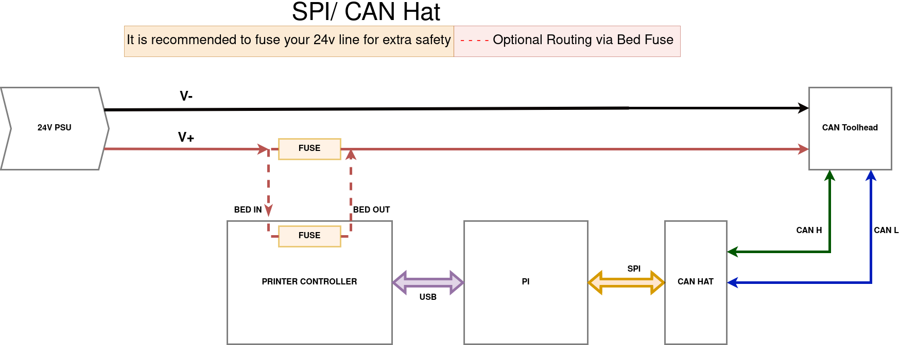
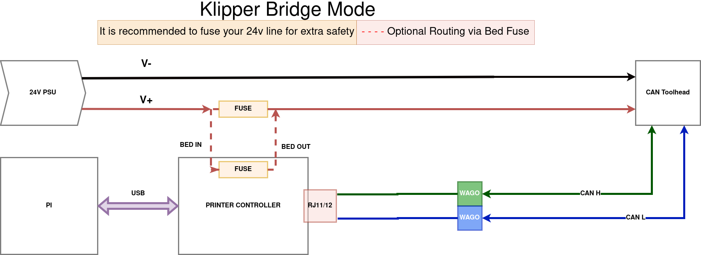
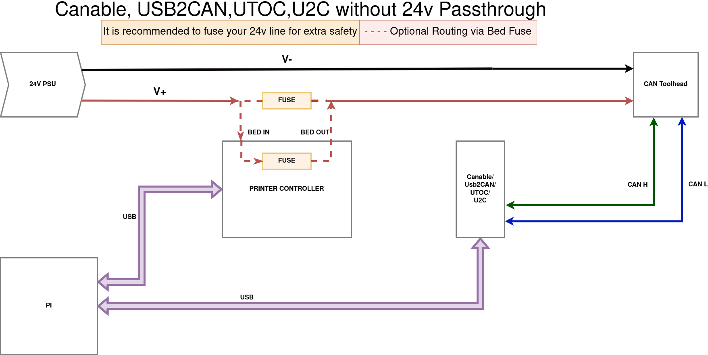
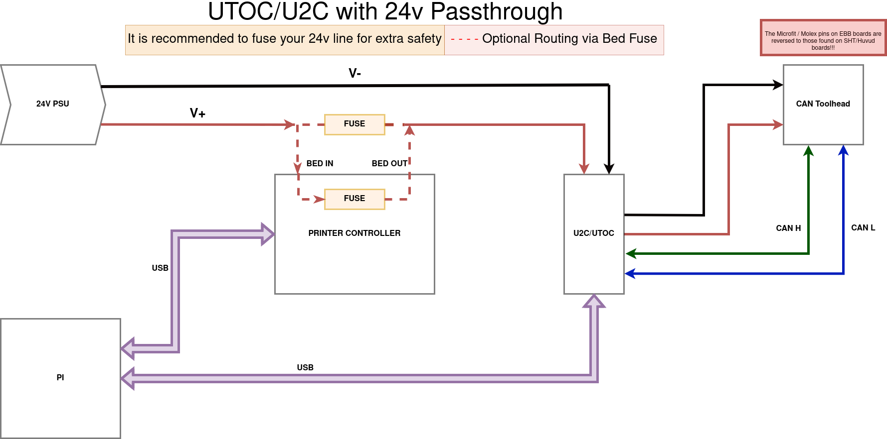

# Wiring examples

### NOTE: This doesnt show exact pinouts as these vary board to board and are covered within that section. instead this is intended to give you an idea of how to wire up the devices.

## SPI / CAN HAT

## Klipper CAN BRIDGE

## USB Adapter without passthrough

## USB Adapter with passthrough

### [Return to Main](../index.md)
